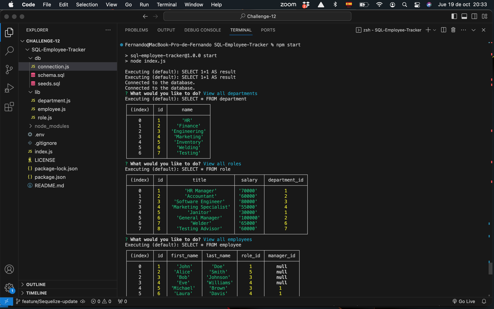
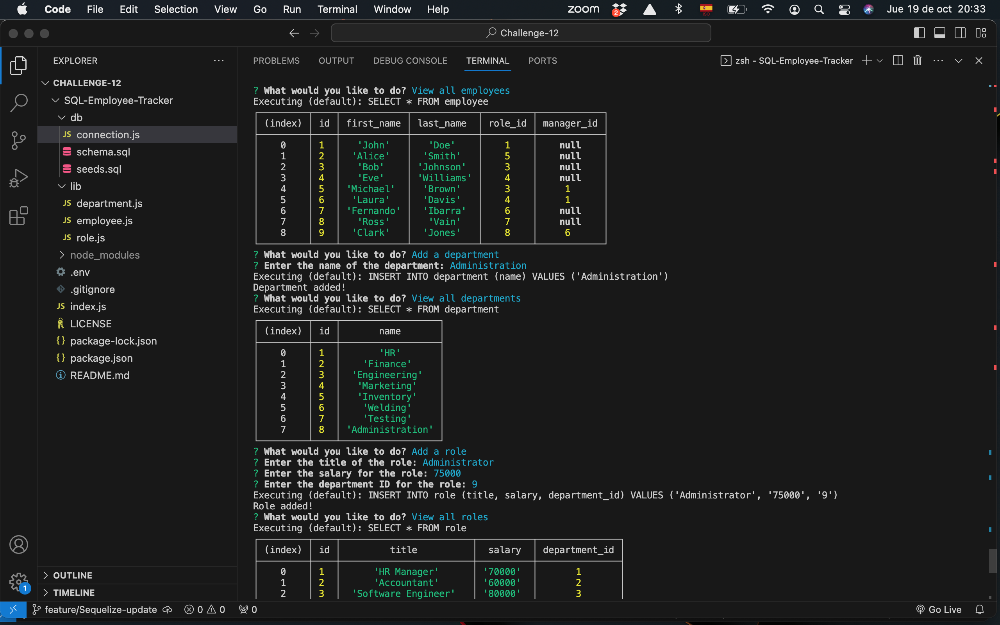
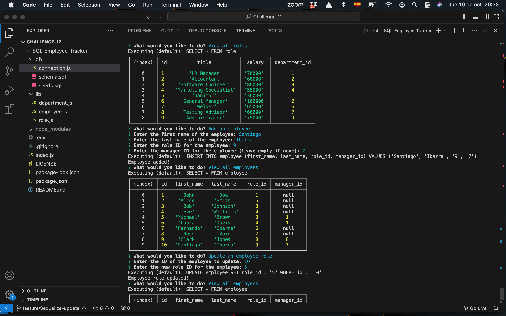
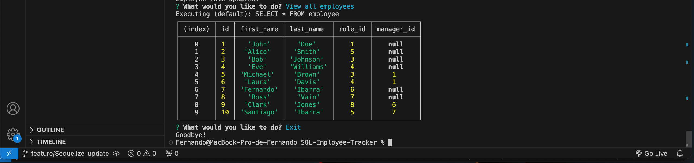

# SQL Employee Tracker

## Description
This command-line application manages a company's employee database, using Node.js, Inquirer, and MySQL.

[](https://opensource.org/licenses/MIT)

## Table of Contents:

- [Overview](#Overview)
- [The Challenge](#The-Challenge)
- [User Story](#User-Story)
- [Acceptance Criteria](#Acceptance-Criteria)
- [Installation Instructions](#Installation-Instructions)
- [Usage Instructions](#Usage-Instructions)
- [Technologies Used](#Technologies-Used)
- [Video Location](#Video-Location)
- [Screenshots](#Screenshots)
- [Test](#Test)
- [Questions](#Questions)
- [Credits](#Credits)
- [License](#License)

# Overview

## Challenge
"The challenge is to build a command-line application from scratch to manage a company's employee database, using Node.js, Inquirer, and MySQL."

## User Story

```md
AS A business owner,
I WANT to be able to view and manage the departments, roles, and employees in my company,
SO THAT I can organize and plan my business.
```

## Acceptance Criteria

```md
GIVEN a command-line application that accepts user input,
WHEN I start the application,
THEN I am presented with the following options: view all departments, view all roles, view all employees, add a department, add a role, add an employee, and update an employee role,
WHEN I choose to view all departments,
THEN I am presented with a formatted table showing department names and department ids,
WHEN I choose to view all roles,
THEN I am presented with the job title, role id, the department that role belongs to, and the salary for that role,
WHEN I choose to view all employees,
THEN I am presented with a formatted table showing employee data, including employee ids, first names, last names, job titles, departments, salaries, and managers that the employees report to,
WHEN I choose to add a department,
THEN I am prompted to enter the name of the department and that department is added to the database,
WHEN I choose to add a role,
THEN I am prompted to enter the name, salary, and department for the role and that role is added to the database,
WHEN I choose to add an employee,
THEN I am prompted to enter the employee’s first name, last name, role, and manager, and that employee is added to the database,
WHEN I choose to update an employee role,
THEN I am prompted to select an employee to update and their new role and this information is updated in the database.
```

## Installation Instructions
1. Clone this repository into your local environment,  
2. Navigate using the command line into the directory with the index.js file, 
3. Run “npm i”, 
4. Check if inquirer [Version 8.2.4](https://www.npmjs.com/package/inquirer/v/8.2.4) is in the dependencies inside the file package.json, if not, run “npm install inquirer@8.4.2”.
5. Check if dotenv [Version 16.3.1](https://www.npmjs.com/package/dotenv) is in the dependencies inside the file package.json, if not, run “npm i dotenv”.
6. Check if mysql2 [Version 3.6.2](https://www.npmjs.com/package/mysql2) is in the dependencies inside the file package.json, if not, run “npm i mysql2”.
7. Check if sequelize [Version 6.33.0](https://www.npmjs.com/package/sequelize) is in the dependencies inside the file package.json, if not, run “npm i sequelize”.
8. Ensure that the information inside .env matches your credentials.


## Usage Instructions
1. Run “npm start” to execute the application, 
2. Choose the action you want to perform, 
3. Follow the prompts writing down all the information required, 
4. Consult the tables as many times as you need.
5. When your have finished, select Exit to close the app.

## Technologies Used
- node.js [Version 16.18.1](https://nodejs.org/en/blog/release/v16.18.1/)
- dotenv [Version 16.3.1](https://www.npmjs.com/package/dotenv)
- inquirer.js: [Version 8.2.4](https://www.npmjs.com/package/inquirer/v/8.2.4)
- mysql2 [Version 3.6.2](https://www.npmjs.com/package/mysql2)
- sequelize [Version 6.33.0](https://www.npmjs.com/package/sequelize)
- Visual Studio Code: [Website](https://code.visualstudio.com/)

## Video Location
[SQL Employee Tracker](https://drive.google.com/file/d/1oclUbdF9q8wkMNryP0o3YyeVpjWqyCGb/view?usp=sharing)

## Screenshots





## Test
This application has been tested running it several times adding information through the command-line.

## Questions?

If you have any questions related with this SQL Employee Tracker, feel free to reach me through:

Email:[fibarrafdec@gmail.com](fibarrafdec@gmail.com)

GitHub username:[fibarrafdec](fibarrafdec)
GitHub link: https://github.com/fibarrafdec

## Credits
This application has been created by © 2023 Fernando Ibarra [fibarrafdec](https://github.com/fibarrafdec).

## License & Copyright ©
This application is covered under the MIT License.
[](https://opensource.org/licenses/MIT)

### Copyright © 2023 Fernando Ibarra
```md
Permission is hereby granted, free of charge, to any person obtaining a copy
of this software and associated documentation files (the "Software"), to deal
in the Software without restriction, including without limitation the rights
to use, copy, modify, merge, publish, distribute, sublicense, and/or sell
copies of the Software, and to permit persons to whom the Software is
furnished to do so, subject to the following conditions:

The above copyright notice and this permission notice shall be included in all
copies or substantial portions of the Software.

THE SOFTWARE IS PROVIDED "AS IS", WITHOUT WARRANTY OF ANY KIND, EXPRESS OR
IMPLIED, INCLUDING BUT NOT LIMITED TO THE WARRANTIES OF MERCHANTABILITY,
FITNESS FOR A PARTICULAR PURPOSE AND NONINFRINGEMENT. IN NO EVENT SHALL THE
AUTHORS OR COPYRIGHT HOLDERS BE LIABLE FOR ANY CLAIM, DAMAGES OR OTHER
LIABILITY, WHETHER IN AN ACTION OF CONTRACT, TORT OR OTHERWISE, ARISING FROM,
OUT OF OR IN CONNECTION WITH THE SOFTWARE OR THE USE OR OTHER DEALINGS IN THE
SOFTWARE.
```